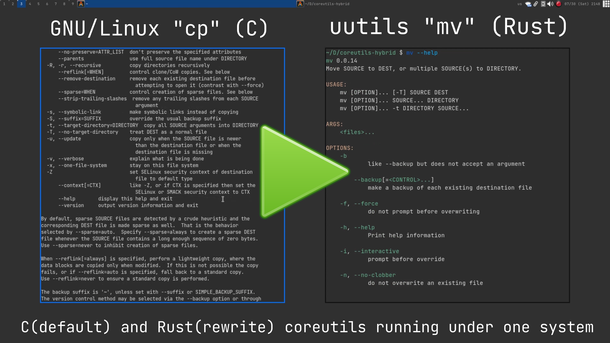

<meta name="color-scheme" content="light dark">

I'll be honest… this was a very impulsive decision from around 6 months ago when I found the `coreutils-hybrid` package in the AUR. It's nothing more than a hybrid package which uses stable rust-uutils programs mixed with GNU counterparts if the uutils counterpart are unfinished/buggy. I don't really know what draws my interest to the rust-uuils, maybe it was the initial assumption that the utilitles were ***strictly POSIX-compliant***, which I later discovered that they were not. 

Why am I interested in ***strict POSIX-Compliance***? well… I don't know either, maybe it's all the people that try my scripts on macOS and it straight up doesn't work because I wasn't aware of what "GNU-isms" were at the time 🤦🏽‍♂️ 😂 . As you can see, there is not substance to the decision, but I did it anyway.

[](rust-uutils.mp4)

As seen in the video, it doesn't use all of the rust-uutils (cp was still its GNU version) and I'll be honest… as I've used my system for the normal gen-Z stuff, I totally forgot I made this change. I guess that goes to show how usable and seamless the `rust-uutils` are.

I, then decided to take this a step further by adding the following aliases to my `fish` config:

```

    # Command Substitutions 
        alias echo="uu-echo"
        alias ls="uu-ls --group-directories-first -h -p --color -F"
        alias pwd="uu-pwd"
        alias groups=uu-groups
        alias kill=uu-kill
        alias ln=uu-ln

        ## Experimental/Risky rust-uutits Substitutions for Testing
        alias basenc=uu-basenc
        alias date=uu-date
        alias false=uu-false
        alias hostname=uu-hostname
        alias join=uu-join
        alias pathchk=uu-pathchk
        alias realpath=uu-realpath
        alias tail=uu-tail
        alias touch=uu-touch
        alias true=uu-true
        alias uptime=uu-uptime

        # Plan9 Utils Command Substitutions
        alias sort="9 sort"
        alias grep="9 grep"

```

So now, I'm using even more of the rust-uutils (at least on an interactive shell) and so far it has been very seamless that on most days I forget I'm even running this, until I need to search for an argument with `--help` or the `man` page.

I'll continue to report on this, but as of right now this has been very much viable without any distinguishable differences with the GNU coreutils. Granted, I have not tested performance nor have I written very complex `sh` scripts in the past few months, but for a daily Linux computer intended to be used like a "*normie*" pretty f**king good and more than usable 👌🏽.

My **`GNU/Linux`** system is slowly becoming **`uutils/Linux`** 😂 now we just need a rust re-write of glibc, gdb, and binutils 😅

\
*Disclaimer: I am not anti-GNU, just being playful at the end… toughen up snowflake* ❄

\
\
[\< previous article](../01062023blogredesign)
\
\
[\<\< all articles](../../articles/)\
[\^ home](../../)
