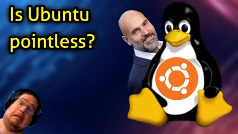

<meta name="color-scheme" content="light dark">

**The [video from TRG](https://youtu.be/QQNj9j_wMss){target="_blank"} was titled \"Is Ubuntu Pointless?\"**

**ChrisTitusTech\'s [video](https://youtu.be/pMfqCzbSmQU){target="_blank"} for reference**

\

\

I recommend that you watch both of their videos so you could see where I
was coming from.

Here was my comment on TRG\'s below:

# \"\"\"\"\"\"\"

Ironically, there\'s a lot of \"missing the point\" fallacies at play,
in a conversation about something being pointless 😂 I think Chris was
really talking about the DESKTOP EXPERIENCE of the distro, which I can
kind of attest to. I install Ubuntu on all of my family\'s PCs and I
recently updated their laptops. They complained that Firefox (now a
snap, in 22.04) launched much slower than before. They\'re definitely
not tech savvy at all and I just installed Ubuntu on their systems for
performance since they\'re on slightly older hardware (I also prefer
troubleshooting on Linux, than Windows ofc 😉). So for them to notice a
rather bad user experience, kind of goes to show that the desktop
experience may not as great as it used to be. Rarely heard complaints
from them when it comes to running Linux, in fact, it was mostly
praises. I can still see the value of snap packages, it\'s was a great
idea theoretically even on the server side of things. However, for it to
be a little bit \"half-baked\" and be pushed on for default applications
on Ubuntu DESKTOP, was not their best idea.\"

Now when it comes to server and the huge impact of Ubuntu to the rest of
the Linux community: being the preferred server distribution (myself
included), its many important corporate partnerships, the great
contributions to GNOME development, and the 65+ derivatives from it... I
definitely 100% agree with you, it\'s great! and it\'s an important part
of our Linux sphere, all the points that you just listed out for Ubuntu
COLLECTIVELY are absolutely true and correct --- and in some ways
they\'re indisputable.

Chris talked about the Ubuntu Desktop experience \"declining\", which
could be a cause of concern... I\'m pretty sure most of us started on
Ubuntu because it just worked and their wasn\'t any glaring concerns
with it... now with snaps, unfortunately there is. Snaps are simply
going to be terrible for someone who is going to try Linux for the first
time on an older laptop with a 7200 RPM Hard Drive, and that\'s how
people usually get started on Linux. This is very much similar to how
things were in the 12.04+ days, everyone was concerned about the DESKTOP
EXPERIENCE of the Unity Desktop. 12.04+ on the server, still GREAT;
Canonical during those days, made BIG STRIDES in the Linux community
collectively (still important); Unity\'s Compiz contributions,
OUTSTANDING. That still didn\'t change that the early days of Unity was
not a good user experience on the desktop, not to mention the added
Amazon telemetry 😬.

You made great points about Ubuntu as a whole outside the desktop
sphere, and glossed over the desktop aspect of it during the latter part
of the video. Your main point centered on Ubuntu\'s importance in the
\"Linux Economy\" as a whole (which again, it\'s correct and true).
Chris made decent points about Ubuntu on the desktop and its worsening
user-experience, and only briefly mentioned (if at all) its importance
in other spheres of the Linux community. His main point centered on just
the Ubuntu Desktop experience, where in most of his points were also
true and correct.

I do lean towards your perspective more. I no longer use Ubuntu, but I
still find many avenues to contribute back to the distro because I am
aware of its importance as an \"OG\".

Two very valid main points from you and Chris. The thing is, your main
points don\'t necessarily go directly against each other, nor does it
really address each other.

Hence, (unfortunately) \"missing the point\" 😅.

Ubuntu can still be a crucial part of the Linux community (as you have
said), but still have a less than desirable desktop experience as it
transitions into snap packages (as Chris has said). There\'s no need to
insinuate that the other person is smoking a crackpipe or dead wrong &
stupid 😂 you two made valid and great points for two different things.

# \"\"\"\"\"\"\"

I guess that speaks for itself in most cases. Have a good rest of the
day y\'all 😅
\
\
\
\
[\> next article](../01062023groff-and-catv-is-now-here)\
[\< previous article](../071422mrusagen-z)
\
\
[\<\< all articles](../../articles/)\
[\^ home](../../)
